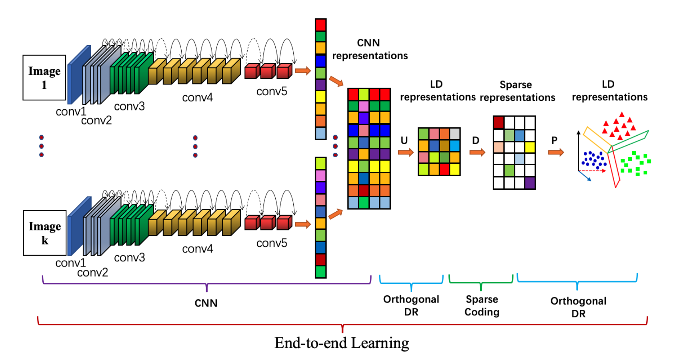

# Integrating Convolution and Sparse Coding for Learning Low-Dimensional Discriminative Image Representations

This code is just for SparConvLow.

This work investigates the problem of efficiently learning discriminative low-dimensional representations of multi-class image objects. We propose a generic end-to-end joint learning approach called SparConvLow by taking the advantage of Convolutional Neural Network (CNN), sparse dictionary learning, and orthogonal projections. The whole learning process can be summarized as follows. Firstly, a CNN module is employed to extract High-Dimensional (HD) preliminary convolutional features. Secondly, to avoid the high computational cost of direct sparse coding on HD CNN features, we learn Sparse Representation (SR) over a task-driven dictionary in the space with the feature being orthogonally projected. We then exploit the discriminative projection on SR. The whole learning process is consistently treated as an end-to-end joint optimization problem of trace quotient maximization. The cost function is well defined on the product of the CNN parameters space, the Stiefel manifold, the Oblique manifold, and the Grassmann manifold. By using the explicit gradient delivery, the cost function is optimized via a geometrical stochastic gradient descent algorithm along with the chain rule and the backpropagation. The experimental results show that the proposed method can achieve a highly competitive performance with state-of-the-art image classification, object categorization and face recognition methods, under both supervised and semi-supervised settings. 

## SparConvLow Architecture



## Related papers
### 	Citations

```
@article{wei2019trace_pami,
  title={Trace quotient with sparsity priors for learning low dimensional image representations},
  author={Wei, Xian and Shen, Hao and Kleinsteuber, Martin},
  journal={IEEE transactions on pattern analysis and machine intelligence},
  volume={42},
  number={12},
  pages={3119--3135},
  year={2020},
  publisher={IEEE}
}

@InProceedings{wei2016trace_cvpr,
	title={Trace Quotient Meets Sparsity: A Method for Learning Low Dimensional Image Representations},
	author={Wei, Xian and Shen, Hao and Kleinsteuber, Martin},
	booktitle={Proceedings of the IEEE Conference on Computer Vision and Pattern Recognition (CVPR)},
	pages={5268--5277},
	year={2016}
    }
    
@article{wei2018reconst_tnnls,
  title={Reconstructible Nonlinear Dimensionality Reduction via Joint Dictionary Learning.},
  author={Xian Wei and Hao Shen and Yuanxiang Li and Xuan Tang and Fengxiang Wang and Martin Kleinsteuber and Yi Lu Murphey},
  journal={IEEE transactions on neural networks and learning systems},
  	volume={30},
	number={1},
	pages={175--189},
  year={2019}
}

```

## Code

### 	Directory Structure

```
.
├── models                     # Backbone CNN models                
│   ├── __init__.py
│   ├── EffNet.py
│   ├── resnet.py
│   └── vgg.py
│   └── WideResNet.py
├── utils					  
│   ├── arg.py                  # Parameter profile 
│   ├── utils_select_model.py	# Choose CNN model
│   └── utils_loaddata.py		# Load dataset
│   └── utils_LDAsparlow.py		# Functions
├── 0_main_CNN.py
├── 1_main_SparConvLow.py
└── README.md

```

### 	Install dependencies ((Python 3 + NVIDIA GPU + CUDA. Recommend to use Anaconda))

```
argparse ==	1.1
numpy	 ==	1.19.2	
spams	 ==	2.6.2.5
scipy	 ==	1.5.4
sklearn	 ==	0.24.0
pytorch	 ==	1.7.1
torchvision == 0.8.2
```

### 	The support dataset

```
CIFAR-10/100
SVHN
FANSHION-MNIST
CALTECH-101/256
IMAGENET
CMU-PIE face
YaleB face
...
```

### 	Train/Test

### 	Pre-train the CNN model

```shell
python 0_main_net.py
```

### 	Train and test the end-to-end framework

```shell
python 1_SparConv.py
```


